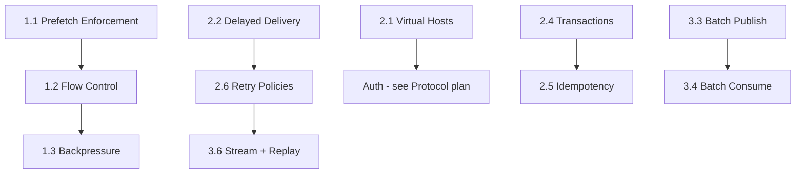

# Core Broker — Implementation Plan

> [!NOTE]
> Covers 4 partial (🟡) and 19 missing (❌) features in the core broker layer.

---

## Phase 1 — Fix Partials (Sprint 9)

### 1.1 Enforce Prefetch / QoS 🟡→✅

**Problem:** `ChannelState.prefetch_count` is stored but never checked before delivery.

**Changes:**
- **`publish.rs`** — Before calling `queue.next_target()`, check if the target connection's channel can accept more messages:
  ```rust
  // After selecting target_id from round-robin
  if let Some(cs) = broker.conn_state.get(&target_id) {
      if !cs.channels.values().any(|ch| ch.can_deliver()) {
          // Skip this consumer, try next or buffer
          queue.messages.push_back(msg);
          continue;
      }
  }
  ```
- **`ack.rs`** — Decrement `unacked_count` on ack.
- **`publish.rs`** — Increment `unacked_count` on delivery.
- **Tests:** Verify that a consumer with `prefetch=1` only receives 1 unacked message at a time.

### 1.2 Flow Control 🟡→✅

**Problem:** No protocol-level flow control. Only implicit backpressure via mpsc channel capacity.

**Changes:**
- Add `ChannelFlow` / `ChannelFlowOk` events (`0x2E` / `0x2F`) to protocol.
- Handler: `channel_flow.rs` — sets `flow_active: bool` on `ChannelState`.
- `publish.rs` — Skip consumers with `flow_active == false`.
- **TS client:** `channel.flow(active: boolean)` method.

### 1.3 Backpressure 🟡→✅

**Problem:** Only implicit (mpsc buffer full blocks sender).

**Changes:**
- Track `mpsc::Sender::capacity()` per connection.
- When capacity drops below threshold, pause delivery to that connection.
- Send `ChannelFlow(false)` to the consumer as a signal.
- Resume with `ChannelFlow(true)` when capacity recovers.

### 1.4 Shared Subscriptions 🟡→✅

**Problem:** Multiple listeners get round-robin but there's no named consumer group concept.

**Changes:**
- Add `consumer_tag: String` to the Listen payload (`consumer_tag:my-tag\r\n`).
- Track `consumer_tag → conn_id` in `QueueState`.
- Cancel individual consumers via `BasicCancel` event.
- **TS client:** `channel.consume(queue, handler, { consumerTag })` and `channel.cancel(tag)`.

---

## Phase 2 — Core Missing Features (Sprint 10)

### 2.1 Virtual Hosts ❌

**Design:** Namespace isolation — each vhost has its own exchanges, queues, bindings, and permissions.

**Changes:**
- **`broker.rs`** — Wrap per-vhost state:
  ```rust
  pub struct VHost {
      pub name: String,
      pub exchanges: RwLock<HashMap<String, Exchange>>,
      pub queues: DashMap<String, QueueState>,
  }
  ```
- **`BrokerState`** — `vhosts: DashMap<String, VHost>` instead of flat queues/exchanges.
- **Protocol** — Add `VHostOpen(0x30)` / `VHostOpenOk(0x31)` events. Client sends vhost name during connection handshake.
- **Default:** `"/"` vhost created on startup.
- **All handlers** — Resolve vhost from connection state before accessing queues/exchanges.
- **TS client:** `new RocketMQ({ host, port, vhost: "/production" })`.

### 2.2 Delayed Delivery / Scheduled Messages ❌

**Design:** Messages with a `x-delay` header are held in a delay buffer and only enqueued after the delay expires.

**Changes:**
- **`broker.rs`** — Add `DelayedMessage` struct with `deliver_at: Instant`.
- **`delayed_queue.rs`** — `BTreeMap<Instant, Vec<Message>>` sorted by delivery time.
- **Background task** — `tokio::spawn` a timer that polls the delay queue every 100ms and moves ready messages into target queues.
- **`publish.rs`** — If `x-delay` header present, route to delay buffer instead of immediate delivery.
- **TS client:** `channel.publish(exchange, key, body, { headers: { "x-delay": 5000 } })`.

### 2.3 Queue TTL ❌

**Design:** Queues auto-delete after being idle (no consumers, no messages) for `x-expires` milliseconds.

**Changes:**
- Add `expires: Option<Duration>` to `QueueOptions`.
- Track `last_activity: Instant` per queue.
- Background task sweeps queues every second, removes expired idle queues.

### 2.4 Transactions ❌

**Design:** `tx.select` → `tx.commit` / `tx.rollback` — batch publish + ack atomically.

**Changes:**
- **Protocol events:** `TxSelect(0x32)`, `TxSelectOk(0x33)`, `TxCommit(0x34)`, `TxCommitOk(0x35)`, `TxRollback(0x36)`, `TxRollbackOk(0x37)`.
- **`ConnectionState`** — Add `tx_buffer: Vec<PendingOp>` where `PendingOp` is `Publish(msg)` | `Ack(msg_id)`.
- **`tx_select.rs`** — Enable transaction mode on connection.
- **`publish.rs` / `ack.rs`** — If tx mode, buffer ops instead of executing.
- **`tx_commit.rs`** — Execute all buffered ops atomically.
- **`tx_rollback.rs`** — Discard buffer.

### 2.5 Idempotency / Message Deduplication ❌

**Design:** Producer provides a `message-id` header. Broker keeps a dedup window.

**Changes:**
- **`broker.rs`** — `dedup_cache: DashMap<String, Instant>` with TTL-based eviction.
- **`publish.rs`** — Check `message-id` header against cache. If seen within window, skip and return `PublishAck`.
- **Background task** — Evict expired dedup entries every 10s.
- **Config:** `dedup_window_ms: u64` (default: 300,000 = 5 minutes).

### 2.6 Retry Policies ❌

**Design:** Per-queue retry configuration with exponential backoff.

**Changes:**
- Add to `QueueOptions`:
  ```rust
  pub max_retries: Option<u32>,
  pub retry_delay_ms: Option<u64>,
  pub retry_multiplier: Option<f64>,
  ```
- Track `delivery_count: u32` on `Message`.
- On nack with `requeue:true`: if `delivery_count >= max_retries`, route to DLX instead.
- Delay redelivery by `retry_delay_ms * multiplier^attempt` using the delayed queue.

---

## Phase 3 — Advanced Patterns (Sprint 11)

### 3.1 RPC / Request-Reply ❌

**Changes:**
- Support `reply_to` and `correlation_id` headers in Publish.
- `publish.rs` — If `reply_to` is set, include it in the Deliver frame.
- Consumer reads `reply_to`, publishes response to that queue with matching `correlation_id`.
- **TS client helper:** `channel.sendRPC(queue, body, timeout)` → returns Promise that resolves when reply arrives.
- **Exclusive reply queue:** Auto-create `amq.gen-{uuid}` exclusive queue for each RPC caller.

### 3.2 Consumer Groups ❌

**Changes:**
- Add `group: Option<String>` to Listen payload.
- `QueueState` — `groups: HashMap<String, Vec<u64>>` mapping group name to member connections.
- Delivery: round-robin within each group, broadcast across groups.

### 3.3 Batch Publishing ❌

**Changes:**
- New event `BatchPublish(0x38)` — payload contains multiple messages prefixed with count.
- Format: `[count:u16][msg1_len:u32][msg1_data][msg2_len:u32][msg2_data]...`
- Handler unpacks and processes each message through the normal publish path.
- WAL: single `BatchEnqueue` entry for atomicity.

### 3.4 Batch Consumption ❌

**Changes:**
- New event `BatchDeliver(0x39)` — broker batches up to `prefetch_count` messages.
- Only sent when consumer has capacity for multiple messages.
- Consumer acks individually or with `multiple:true` flag.

### 3.5 Rate Limiting ❌

**Changes:**
- Token-bucket rate limiter per queue: `rate_limit: Option<u32>` (msgs/sec).
- `publish.rs` — Check token availability before enqueue.
- Refill tokens on a timer.

### 3.6 Stream + Replay Support ❌

**Changes:**
- New queue type: `x-queue-type: stream`.
- Stream queues are append-only (never delete on ack).
- Consumers track offsets: `x-stream-offset: 42` or `x-stream-offset: timestamp`.
- Replay: consumer re-reads from any past offset.
- Storage: requires segment files (see Storage plan).

---

## Dependency Graph


