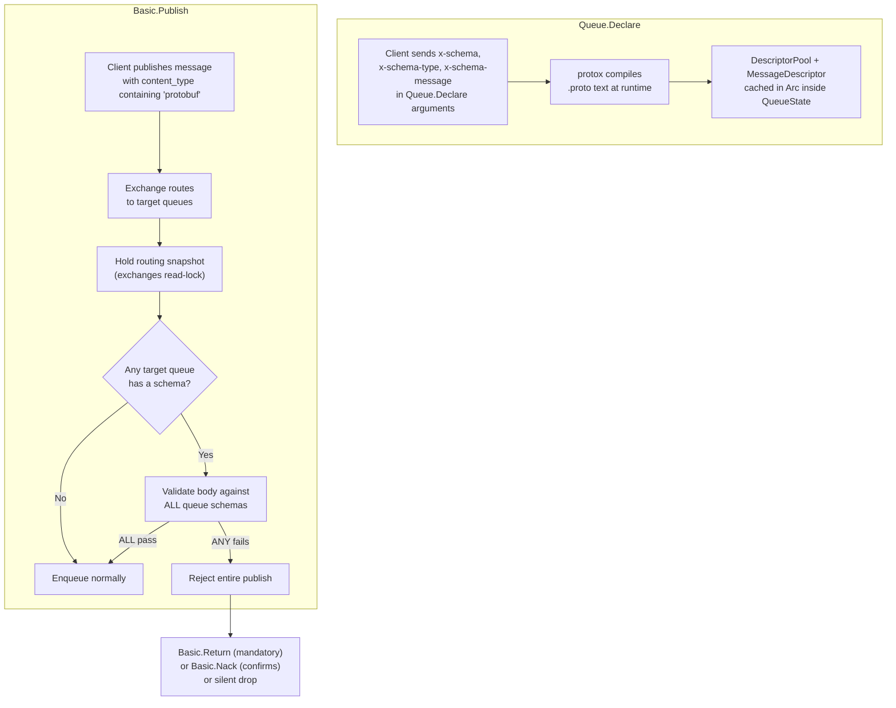

# Schema Validation — Feature Specification

> Production-grade message schema validation for RocketMQ.
> Queues declare a protobuf schema at creation time; every published message
> is validated against the schema before enqueueing.

---

## Feature Summary

| Property | Value |
|---|---|
| Status | Planned |
| Target release | v0.2.0 |
| Sprints | 4 (see below) |
| AMQP compatibility | Fully compatible — uses `x-*` arguments, no protocol extensions |
| Schema format | Protobuf `.proto` text (Phase 1) |
| Payload encoding | Protobuf binary wire format |
| Validation model | Atomic — all target queues must pass before any enqueue |

---

## Architecture



---

## AMQP Contract

### Declare Arguments

| Argument | AMQP Type | Required | Description |
|---|---|---|---|
| `x-schema` | `LongString` | Yes (to enable validation) | Raw `.proto` file content |
| `x-schema-type` | `LongString` | Yes | Must be `"protobuf"` in Phase 1 |
| `x-schema-message` | `LongString` | Yes | Fully qualified message name to validate against (e.g. `"mypackage.UserCreated"`) |

### Publish Requirements

| Property | Requirement |
|---|---|
| `content_type` | Must contain `"protobuf"` (accepts `application/protobuf`, `application/x-protobuf`, etc.) |
| Body encoding | Protobuf binary wire format matching the declared message type |

### Error Semantics

| Mode | On Validation Failure |
|---|---|
| Mandatory publish | `Basic.Return` with reply code `312` (`NO_ROUTE`) and descriptive text |
| Publisher confirms | `Basic.Nack` |
| Tx mode | Validation runs at `Tx.Commit`; failed validation causes commit rejection |
| Non-mandatory, no confirms | Silent drop + warning log |

Channel and connection are NEVER closed for validation failures.

---

## Schema Immutability

Queue schemas are **immutable forever** once declared.

- Re-declaring with the identical schema → idempotent success
- Re-declaring with a different schema → `PRECONDITION_FAILED`
- Schema is dropped only when the queue is deleted

**Migration path:**
1. Create new queue with new schema
2. Bind new queue to exchange
3. Move consumers
4. Delete old queue

---

## Internal Model

```rust
pub enum SchemaFormat {
    Protobuf,
    // Future: JsonSchema, Avro
}

pub struct CompiledSchema {
    pub id: u64,
    pub format: SchemaFormat,
    pub raw: Vec<u8>,                                     // original .proto text
    pub descriptor_set_bytes: Vec<u8>,                    // serialized FileDescriptorSet
    pub pool: prost_reflect::DescriptorPool,              // built once at declare
    pub message_descriptor: prost_reflect::MessageDescriptor,  // cached lookup
}

// Stored in QueueState as:
pub schema: Option<Arc<CompiledSchema>>
```

---

## Sprint Index

| Sprint | Title | Scope |
|---|---|---|
| [Sprint 1](sprint_1_core_schema_module.md) | Core Schema Module | Dependencies, types, `protox` compilation, validation function, unit tests |
| [Sprint 2](sprint_2_queue_integration.md) | Queue Integration | `QueueOptions` fields, `QueueState` storage, `handle_declare()` wiring, immutability enforcement |
| [Sprint 3](sprint_3_publish_validation.md) | Publish Validation Gate | Atomic multi-queue validation in `handle_publish()`, content-type checks, error responses, tx commit validation |
| [Sprint 4](sprint_4_persistence_and_hardening.md) | Persistence & Hardening | WAL schema entries, recovery path, end-to-end tests, performance benchmarks, documentation |

---

## Dependencies

```toml
prost = "0.13"
prost-types = "0.13"
prost-reflect = "0.14"
protox = "0.7"
bytes = "1"
```

---

## Future Phases (Out of Scope)

Reserved architecturally but not implemented in v0.2.0:

- JSON Schema validation (native `jsonschema` crate, NOT proto translation)
- Avro validation (native `apache-avro` crate)
- Schema registry with `schema_id → CompiledSchema` mapping
- Envelope protocol: `message BrokerEnvelope { uint64 schema_id = 1; bytes payload = 2; }`
- Compatibility modes (backward, forward, full)
- Topic-version routing (`created.v1`, `created.v2`)
- Management dashboard UI for schema CRUD
- Cluster schema replication
